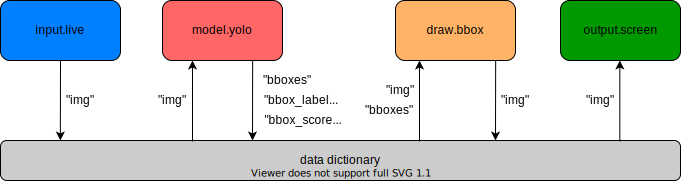

<div align="center">
    
    <h1>PeekingDuck</h1>
</div>

[](https://pypi.org/project/peekingduck/)
[](https://pypi.org/project/peekingduck/)
[](LICENSE)

## What is PeekingDuck?

PeekingDuck is an open-source, modular framework in Python, built for Computer Vision (CV) inference. It helps to significantly cut down development time when building CV pipelines. The name "PeekingDuck" is a play on these words: "Peeking" in a nod to CV; and "Duck" in [duck typing](https://en.wikipedia.org/wiki/Duck_typing).

## Install PeekingDuck

1. Install PeekingDuck from [PyPI](https://pypi.org/project/peekingduck/).
    ```
    pip install peekingduck
    ```

2. Create a project folder at a convenient location, and initialize a PeekingDuck project.
    ```
    mkdir <project_name>
    cd <project_name>
    peekingduck init
    ```
    The following files and folders would be created upon running `peekingduck init`. We'll discuss more about run_config.yml and custom_nodes later.
    ```
    <project_name>
     ├── run_config.yml
     └── src
          └── custom_nodes
    ``` 

3. Run a demo.
    ```
    peekingduck run
    ```

    If you have a webcam, you should be able to see the demo running live.

    

## How PeekingDuck Works

Nodes are the basic blocks of PeekingDuck. A node is a wrapper for a Python function, and contains information on how other PeekingDuck nodes may interact with it. 

PeekingDuck has 5 types of nodes:
- input: responsible for dealing with various types of inputs such as live video feeds, recorded videos/images, etc, and passing individual frames to other nodes
- model: AI models for object detection, pose estimation, etc
- heuristic: broad class of functions such as algorithms or approximations that transform model results into useful outputs
- draw: draw results such as bounding boxes on frames
- output: responsible for showing results on screen, saving output videos, posting to API endpoint etc

A pipeline governs the behavior of a chain of nodes. Nodes in a pipeline are called in sequential order, and the output of one node will be the input to another. The diagram below shows the pipeline used in the above demo.



## Changing Nodes and Configurations

Earlier on, the `peekingduck init` command created the `run_config.yml` file, which is responsible for:
- Selecting which nodes to include in the pipeline
- Selecting the settings of each node

In the earlier demo, `run_config.yml` ran an object detection demo containing the following nodes:
```
nodes:
  - input.live
  - model.yolo
  - draw.bbox
  - output.screen
```

Now, let's modify it to run a pose estimation demo containing the following nodes:
```
nodes:
  - input.live
  - model.posenet
  - draw.poses
  - output.screen
```

If you have a webcam, you should be able to see the demo running live.


Now let's try changing node settings. We were using webcam for previous demos, and now let's try inferencing on a recorded video. We'll use the `input.recorded` and `output.media_writer` nodes for that, and you'll have to change the directory where the video is stored.

```
nodes:
  - input.recorded:
    - input_source: <path of video>
  - model.posenet
  - draw.poses
  - output.media_writer
    - outputdir: <directory to save video result>
```

## Explore PeekingDuck Nodes

We're constantly developing new nodes to increase PeekingDuck's capabilities. You've had a taste of some of our commonly used nodes in the above demo, but PeekingDuck can do a lot more. To see what other nodes are commonly used, check out the [node glossary](node_glossary.md).

PeekingDuck can be used for many real life use cases. To see what other use cases are available, check out the [use case glossary](use_case_glossary.md).


## Create Custom Nodes


## Contributions


