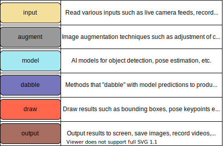
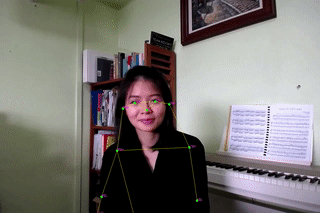
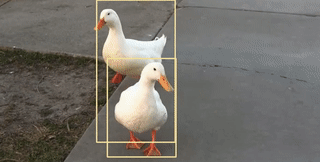
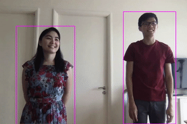
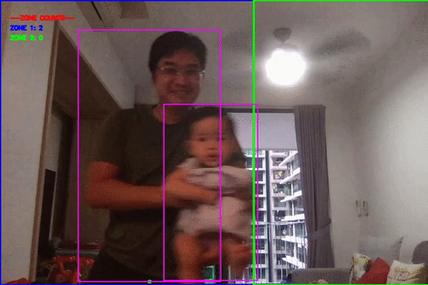
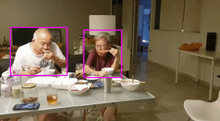

<div align="center">
    
    <h1>PeekingDuck</h1>
</div>

[](https://pypi.org/project/peekingduck/)
[](https://pypi.org/project/peekingduck/)
[](LICENSE)

## What is PeekingDuck?

PeekingDuck is an open-source, modular framework in Python, built for Computer Vision (CV) inference. It helps to significantly cut down development time when building CV pipelines. The name "PeekingDuck" is a play on these words: "Peeking" in a nod to CV; and "Duck" in [duck typing](https://en.wikipedia.org/wiki/Duck_typing).

## Install and Run PeekingDuck

1. Install PeekingDuck from [PyPI](https://pypi.org/project/peekingduck/).
    ```
    > pip install peekingduck
    ```
    *Note: if installing on a device with an ARM processor such as a Raspberry Pi, include the `--no-dependencies` flag.*

2. Create a project folder at a convenient location, and initialize a PeekingDuck project.
    ```
    > mkdir <project_dir>
    > cd <project_dir>
    > peekingduck init
    ```
    The following files and folders will be created upon running `peekingduck init`:
    - `run_config.yml` is the main configuration file for PeekingDuck. It currently contains the [default configuration](run_config.yml), and we'll show you how to modify it in a [later section](#changing-nodes-and-settings).
    - `custom_nodes` is an optional feature that is discussed in a [subsequent section](#create-custom-nodes).
    ```
    <project_dir>
     ├── run_config.yml
     └── src
          └── custom_nodes
    ```

3. Run a demo.
    ```
    > peekingduck run
    ```

    If you have a webcam, you should see the demo running live:

    

    The previous command looks for a `run_config.yml` in the current directory. You can also specify the path of a different config file to be used, as follows:
    ```
    > peekingduck run --config_path <path_to_config>
    ```

    Terminate the program by clicking on the output screen and pressing `q`.

4. For more help on how to use PeekingDuck's command line interface, you can use `peekingduck --help`.

## How PeekingDuck Works

**Nodes** are the building blocks of PeekingDuck. Each node is a wrapper for a Python function, and contains information on how other PeekingDuck nodes may interact with it.

PeekingDuck has 5 types of nodes:



A **pipeline** governs the behavior of a chain of nodes. The diagram below shows the pipeline used in the previous demo. Nodes in a pipeline are called in sequential order, and the output of one node will be the input to another. For example, `input.live` produces "img", which is taken in by `model.yolo`, and `model.yolo` produces "bboxes", which is taken in by `draw.bbox`.


## Changing Nodes and Settings

Earlier on, the `peekingduck init` command created the `run_config.yml` file, which is PeekingDuck's main configuration file and is responsible for:
- Selecting which nodes to include in the pipeline
- Configuring node behaviour

**1. Selecting which nodes to include in the pipeline**:

  - In the earlier object detection demo, `run_config.yml` used the following nodes:
    ```
    nodes:
      - input.live
      - model.yolo
      - draw.bbox
      - output.screen
    ```
  - Now, let's modify it to run a pose estimation demo using the following nodes:
    ```
    nodes:
      - input.live
      - model.posenet
      - draw.poses
      - output.screen
    ```

  - If you have a webcam, you should see the demo running live:

    

    Terminate the program by clicking on the output screen and pressing `q`.

**2. Configuring node behaviour**:
- If you're not using a webcam, don't worry about missing out! PeekingDuck is also able to work on recorded videos or saved images, and we'll use the `input.recorded` and `output.media_writer` nodes for that. For this demo, you'll have to [download](https://peekingduck.blob.core.windows.net/videos/ducks.mp4.zip) and unzip a short video of ducks, and use `model.yolo` again to detect them.

- We'll need to change the settings of 3 nodes, in order to set the input and output directories, and also to alter the object to be detected from a human to a bird, as follows:
  ```
  nodes:
    - input.recorded:       # note the ":"
        input_dir: <directory where videos/images are stored>
    - model.yolo:           # note the ":"
        detect_ids: [14]    # ID to detect the "bird" class is 14 for this model
    - draw.bbox
    - output.media_writer:  # note the ":"
        output_dir: <directory to save results>
  ```
- Once PeekingDuck has finished running, the processed files will be saved to the specified output directory. Open the processed file and you should get this:

  

- To find out what other settings can be tweaked for different nodes, check out PeekingDuck's [API Reference](https://peekingduck.readthedocs.io/en/stable/peekingduck.pipeline.nodes.html).

## Explore PeekingDuck Nodes

AI models are cool and fun, but we're even more interested to use them to solve real-world problems. We've combined heuristic nodes with model nodes to create **use cases**, such as [social distancing](https://aisingapore.org/2020/06/hp-social-distancing/) and [group size checking](https://aisingapore.org/2021/05/covid-19-stay-vigilant-with-group-size-checker/) to help combat COVID-19. For more details, click on the heading of each use case below.

| | |
|-|-|
| [Social Distancing](docs/source/use_cases/social_distancing.md) | [Zone Counting](docs/source/use_cases/zone_counting.md) |
| ||
| [Group Size Checking](docs/source/use_cases/group_size_checking.md) | [Object Counting](docs/source/use_cases/object_counting.md) |
|| |
| | |

We're constantly developing new nodes to increase PeekingDuck's capabilities. You've gotten a taste of some of our commonly used nodes in the previous demos, but PeekingDuck can do a lot more. To see what other nodes are available, check out PeekingDuck's [API Reference](https://peekingduck.readthedocs.io/en/stable/peekingduck.pipeline.nodes.html).

## Create Custom Nodes

You may need to create your own custom nodes. Perhaps you'd like to take a snapshot of a video frame, and post it to your API endpoint; perhaps you have a model trained on a custom dataset, and would like to use PeekingDuck's `input`, `draw`, and `output` nodes.

We've designed PeekingDuck to be very flexible - you can create your own nodes and use them with ours. This [guide](docs/source/introduction/guide_custom_nodes.md) provides more details on how to do that.

## Acknowledgements

This project is supported by the National Research Foundation, Singapore under its AI Singapore Programme (AISG-RP-2019-050). Any opinions, findings and conclusions or recommendations expressed in this material are those of the author(s) and do not reflect the views of National Research Foundation, Singapore.

## License

PeekingDuck is under the open source [Apache License 2.0](LICENSE) (:

Even so, your organisation may require legal proof of its right to use PeekingDuck, due to circumstances such as the following:
- Your organisation is using PeekingDuck in a jurisdiction that does not recognise this license
- Your legal department requires a license to be purchased
- Your organisation wants to hold a tangible legal document as evidence of the legal right to use and distribute PeekingDuck

[Contact us](https://aisingapore.org/home/contact/) if any of these circumstances apply to you.

## Additional References
#### Object Detection

PeekingDuck utilises the 4th version of the YOLO model [1]. PeekingDuck's YOLO model weights are trained by [2] and the inference code is adapted from [3].

In addition, PeekingDuck also employs EfficientDet [4] with code that is adapted from [5]. The team referred to [6] during the development of PeekingDuck.

1. Bochkovskiy, Alexey, et al. “YOLOv4: Optimal Speed and Accuracy of Object Detection.” ArXiv:2004.10934 [Cs, Eess], Apr. 2020. [arXiv.org](http://arxiv.org/), [http://arxiv.org/abs/2004.10934](http://arxiv.org/abs/2004.10934).
2. “GitHub - Hunglc007/Tensorflow-Yolov4-Tflite: YOLOv4, YOLOv4-Tiny, YOLOv3, YOLOv3-Tiny Implemented in Tensorflow 2.0, Android. Convert YOLO v4 .Weights Tensorflow, Tensorrt and Tflite.” GitHub, [https://github.com/hunglc007/tensorflow-yolov4-tflite](https://github.com/hunglc007/tensorflow-yolov4-tflite)
3. “GitHub - Zzh8829/Yolov3-Tf2: YoloV3 Implemented in Tensorflow 2.0.” GitHub, [https://github.com/zzh8829/yolov3-tf2](https://github.com/zzh8829/yolov3-tf2)
4. Tan, Mingxing, et al. “EfficientDet: Scalable and Efficient Object Detection.” ArXiv:1911.09070 [Cs, Eess], July 2020. [arXiv.org](http://arxiv.org/), [http://arxiv.org/abs/1911.09070](http://arxiv.org/abs/1911.09070).
5. “GitHub - Xuannianz/EfficientDet: EfficientDet (Scalable and Efficient Object Detection) Implementation in Keras and Tensorflow.” GitHub, [https://github.com/xuannianz/EfficientDet](https://github.com/xuannianz/EfficientDet)
6. WU, Xiongwei; SAHOO, Doyen; and HOI, Steven C. H.. Recent advances in deep learning for object detection. (2020). Neurocomputing. Research Collection School Of Information Systems.
   Available at: [https://ink.library.smu.edu.sg/sis_research/5096](https://ink.library.smu.edu.sg/sis_research/5096)

#### Pose Estimation

PeekingDuck taps into HRNet [1] and PoseNet [2] to perform human pose estimation with the latter's code being adapted from [3]. The team referred to [4] during the development of PeekingDuck.

1. Wang, Jingdong, et al. “Deep High-Resolution Representation Learning for Visual Recognition.” ArXiv:1908.07919 [Cs], Mar. 2020. [arXiv.org](http://arxiv.org/), [http://arxiv.org/abs/1908.07919](http://arxiv.org/abs/1908.07919).
2. Papandreou, George, et al. “PersonLab: Person Pose Estimation and Instance Segmentation with a Bottom-Up, Part-Based, Geometric Embedding Model.” ArXiv:1803.08225 [Cs], Mar. 2018. [arXiv.org](http://arxiv.org/), [http://arxiv.org/abs/1803.08225](http://arxiv.org/abs/1803.08225).
3. “GitHub - Rwightman/Posenet-Python: A Python Port of Google TensorFlow.Js PoseNet (Real-Time Human Pose Estimation).” GitHub, [https://github.com/rwightman/posenet-python](https://github.com/rwightman/posenet-python)
4. “Action Recognition.” Rapid-Rich Object Search Lab (ROSE), [https://www.ntu.edu.sg/rose/research-focus/deep-learning-video-analytics/action-recognition](https://www.ntu.edu.sg/rose/research-focus/deep-learning-video-analytics/action-recognition)