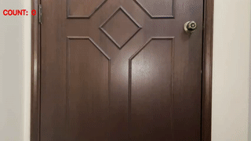

# Object Counting

## Overview

One of the basic task in computer vision is object counting. AI Singapore developed a simple solution built in conjunction with our object detection models. This can be used with CCTVs in malls, shops or factories for crowd control, or other general object counting. For more advanced counting heuristics, checkout out [zoning](zoning.md#zone-counting).



Counting is done by looking at the count of objects detected by the object detection models. As an example, we can count the number of people that appear in a video, as per our example above. This is explained in a [subsequent section](#how-it-works).

## Demo

To try our solution on your own computer with [PeekingDuck installed](https://github.com/aimakerspace/PeekingDuck/blob/dev/README.md/#install-and-run-peekingduck): use the following configuration file: [social_distancing.yml](https://github.com/aimakerspace/PeekingDuck/blob/dev/use_cases/object_counting.yml) and run PeekingDuck.

```
> peekingduck run --config_path <path_to_social_distancing.yml>
```

## How it Works

The main component to obtain the count is the detection from the object detection model, which is the bbounding boxes.

**1. Object Detection**

We use an open source object detection estimation model known as [Yolov4](https://arxiv.org/abs/2004.10934) and its smaller and faster variant known as Yolov4-tiny to identify the bounding boxes of chosen objects we want to detect. This allows the application to identify where objects are located within the video feed. The location is returned as two (x, y) coordinates in the form [x1, y1, x2, y2], where (x1, y1) is the top left corner of the bounding box, and (x2, y2) is the bottom right. These are used to form the bounding box of each object detected.


**2. Object Counting**

To count the number of objects detected, we simply take the sum of the number of bounding boxes detected for the object.

## Nodes Used

These are the nodes used in the earlier demo (also in [object_counting.yml](https://github.com/aimakerspace/PeekingDuck/blob/dev/use_cases/object_counting.yml)):
```
nodes:
- input.live
- model.yolo:
  - detect_ids: [0]
- heuristic.bbox_count
- draw.bbox
- draw.bbox_count
- draw.fps
- output.screen
```

**1. Object Detection Model**

By default, we are using the Yolov4-tiny model for object detection, set to detect people. Depending on the device you're using, you might want to switch to the more accurate Yolov4 model, or even the Effecientdet model that is include in our repo. For more information in how adjust the yolo node, checkout the [Yolo configurable parameters](../models/yolo.md#configurable-parameters). For more information on Efficientdet detection model in PeekingDuck, check out the [node glossary](node_glossary.md).


**2. Adjusting Nodes**

The object counting node does not have changeable configurations. However, it depends on the configuration set in the object detection models, such as the type of object to detect, etc. As such, please see the [Yolo node documentation](../models/yolo.md) or the [Efficientdet node documentation]() for adjustable behaviours that can influence the result of the object counting node.

For more adjustable node behaviours not listed here, check out the [node glossary](node_glossary.md).

## More Complex Counting Behaviour

We have a more complex variant of object counting that is called zone counting which makes use of the zone count node. It allows for the creation of zones within a single image, and provides separate counts of the chosen objects detected for objects that fall inside the zones created.

For more informatio, check out the [readme](zoning.md#zone-counting) for zone counting.

