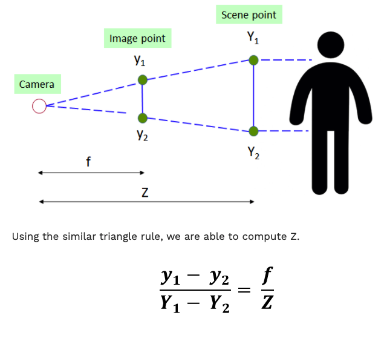

# Object Counting

## Overview

One of the basic task in computer vision is object counting. AI Singapore developed a simple solution built in conjunction with our object detection models. This can be used with CCTVs in malls, shops or factories for crowd control.


Zones are created by providing the point coordinates that form each zone. These are used in conjunction with object detection models upstream to create heuristics that provide specific zone analytics. As an example, we can count the number of people in each particular zone. This is explained in a [subsequent section](#how-it-works).

## Demo

To try our solution on your own computer with [PeekingDuck installed](https://github.com/aimakerspace/PeekingDuck/blob/dev/README.md/#install-and-run-peekingduck): use the following configuration file: [social_distancing.yml](https://github.com/aimakerspace/PeekingDuck/blob/dev/use_cases/zone_count.yml) and run PeekingDuck.

```
> peekingduck run --config_path <path_to_social_distancing.yml>
```

## How it Works

There are two main components to obtain the distance between individuals: 1) human pose estimation using AI; and 2) depth and distance approximation using heuristics.

**1. Human Pose Estimation**

We use an open source human pose estimation model known as [PoseNet](https://arxiv.org/abs/1505.07427) to identify key human skeletal points. This allows the application to identify where individuals are located within the video feed. The coordinates of the various skeletal points will then be used to determine the distance between individuals.


**2. Depth and Distance Approximation**

To measure the distance between individuals, we have to estimate the 3D world coordinates from the keypoints in 2D coordinates. To achieve this, we compute the depth (Z) from the XY coordinates using the relationship below:




Where:
- Z = depth or distance of scene point from camera
- f = focal length of camera
- y = y position of image point
- Y = y position of scene point


Y<sub>1</sub> - Y<sub>2</sub> is a reference or “ground truth length” that is required to obtain the depth. After numerous experiments, it was decided that the optimal reference length would be the average height of a human torso (height from human hip to center of face). Width was not used as this value has high variance due to the different body angles of an individual while facing the camera.

Once we have the 3D world coordinates of the individuals in the video, we can compare the distances between each pair of individuals and check if they are too close to each other.

## Nodes Used

These are the nodes used in the earlier demo (also in [social_distancing.yml](https://github.com/aimakerspace/PeekingDuck/blob/dev/use_cases/social_distancing.yml)):
```
nodes:
- input.live
- model.posenet
- heuristic.keypoints_to_3d_loc:
  - focal_length: 1.14
  - torso_factor: 0.9
- heuristic.check_nearby_objs:
  - near_threshold: 1.5
  - tag_msg: "TOO CLOSE!"
- draw.bbox
- draw.poses
- draw.tag
- draw.fps
- output.screen
```

**1. Pose Estimation Model**

By default, we are using the PoseNet model with a Resnet backbone for pose estimation. Depending on the device you're using, you might want to switch to the lighter mobilenet backbone, or to a heavier HRnet model for higher accuracy. For more information on pose estimation models in PeekingDuck, check out the [node glossary](node_glossary.md).


**2. Adjusting Nodes**

Some common node behaviours that you might need to adjust are:
- `focal_length` & `torso_factor`: We calibrated these settings using a Logitech c170 webcam, with 2 individuals of heights about 1.7m. We recommend running a few experiments on your setup and calibrate these accordingly.
- `tag_msg`: The message to show when individuals are too close.
- `near_threshold`: The minimum acceptable distance between 2 individuals, in metres. For example, if the threshold is set at 1.5m, and 2 individuals are standing 2.0m apart, `tag_msg` doesn't show as they are standing further apart than the threshold. The larger this number, the stricter the social distancing.

For more adjustable node behaviours not listed here, check out the [node glossary](node_glossary.md).

**3. Using Object Detection (Optional)**

It is possible to use object detection nodes such as `model.yolo` instead of pose estimation. To do so, replace the model node accordingly, and replace the node `heuristic.keypoints_to_3d_loc` with `heuristic.bbox_to_3d_loc`. The reference or “ground truth length” in this case would be the average height of a human, multipled by a small factor.

You might need to use this approach if running on a resource-limited device such as a Raspberry Pi. In this situation, you'll need to use the lightweight models, and we find that lightweight object detectors are generally better than lightweight pose estimation models in detecting humans. 

The trade-off here is that the estimated distance between individuals will be less accurate. This is because for object detectors, the bounding box will be compared with the average height of a human, but the bounding box height decreases if the person is sitting down or bending over.

## Using with Group Size Checker

As part of COVID-19 measures, the Singapore Government has set restrictions on the group sizes of social gatherings. We've developed a [group size checker](https://aisingapore.org/2021/05/covid-19-stay-vigilant-with-group-size-checker/) that checks if the group size limit has been violated.

The nodes for group size checker can be stacked with social distancing, to perform both at the same time. To find out which nodes are used, check out the [readme](./group_size_checking.md) for group size checker.

